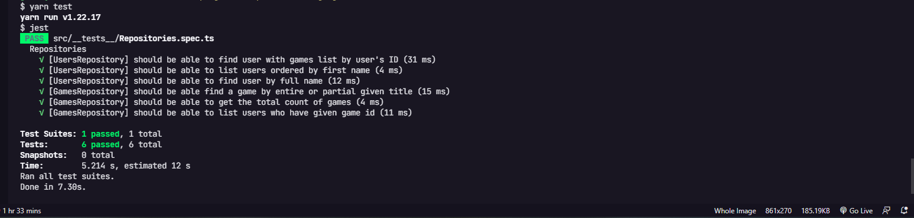
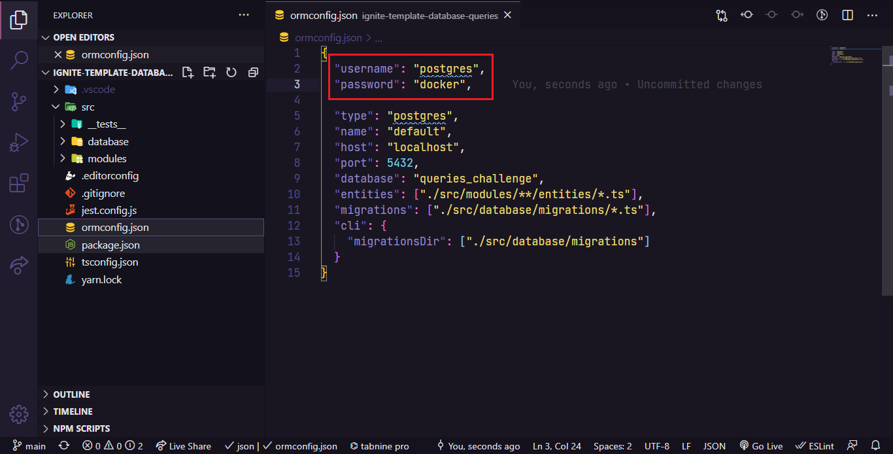

# Desafio 6 do Ignite Trilha NodeJS


<h3 align="center">
  Desafio 06: Database Queries
</h3>


<p align="center">
  <a href="#rocket-sobre-o-desafio">Sobre o desafio</a>&nbsp;&nbsp;&nbsp;|&nbsp;&nbsp;&nbsp;
  <a href="#keyboard-instalação-e-execução-do-projeto">Instalação e Execução do Projeto</a>&nbsp;&nbsp;&nbsp;|&nbsp;&nbsp;&nbsp;
  <a href="#template-da-aplicação">Template da aplicação</a>&nbsp;&nbsp;&nbsp;|&nbsp;&nbsp;&nbsp;
  <a href="#repositórios-da-aplicação-instruções">Repositórios da aplicação</a>&nbsp;&nbsp;&nbsp;|&nbsp;&nbsp;&nbsp;
  <a href="#especificação-dos-testes-instruções">Específicação dos testes</a>&nbsp;&nbsp;&nbsp;|&nbsp;&nbsp;&nbsp;
</p>

## :rocket: Sobre o desafio

Nesse desafio, precisei realizar consultas no banco de dados com o TypeORM de três maneiras:

- Usando o ORM
- Usando Query Builder
- Usando Raw Query

No template constava uma aplicação já estruturada (apenas as entidades e repositórios) onde tive que completar o que falta nas consultas dos dois repositórios.

A aplicação possui dois módulos: `users` e `games`. Um **usuário** pode ter vários jogos e um mesmo **jogo** pode estar associado a vários usuários.

Para conseguir rodar os testes corretamente, é preciso ter um banco de dados PostgreSQL rodando com os seguintes parâmetros:

> - "username": "postgres",
> - "password": "docker",
> - "host": "localhost",
> - "port": 5432,
> - "database": "queries_challenge"

Para facilitar, o projeto possui um arquivo `docker-compose.yml` que já cria o container necessário, porém é preciso ter o Docker instalado em sua máquina: **[Instalação Docker](https://docs.docker.com/desktop/)**

## :keyboard: Instalação e Execução do Projeto

- Clone este repositório

```
> git clone https://github.com/sabinorush/ignite_chapter_03_challgenge_01
```

- Navegue até o diretório principal do projeto

```
> cd ignite-database-queries
```

- Instale as dependências com o Yarn

```
yarn
```

- Inicie um container docker com postgres utilizando o docker-compose

```
docker-compose up -d
```

- Rode a suite de testes

```
yarn test
```

- Pare e remova o container docker

```
docker-compose down
```

<p align="center">
  
</p>

## Template da aplicação

Foi utilizado um modelo de template que possui o esqueleto do projeto.

O template pode ser encontrado na seguinte url: **[Acessar Template](https://github.com/rocketseat-education/ignite-template-database-queries)**

> **Dica**: Caso não saiba utilizar repositórios do Github como template, utilize o guia em **[nosso FAQ](https://www.notion.so/ddd8fcdf2339436a816a0d9e45767664).**

Para que os testes funcionem, é importante que você crie uma database no banco Postgres com o nome queries_challenge:

<p align="center">
  
</p>

## Repositórios da aplicação (Instruções)

Documentação no Notion sobre os repositórios e testes: **[Documentação Repositórios e Testes](https://www.notion.so/Desafio-01-Database-Queries-8d97dae581d5446e97555c43d301ee45)**

Com o repositório criado a partir do template e clonado na sua máquina, navegue até os arquivos **src/modules/users/repositories/implementations/UsersRepository.ts** e **src/modules/games/repositories/implementations/GamesRepository.ts**. 
Esses deverão ser completados para que os testes sejam satisfeitos. 

Observe que alguns métodos já possuem parte do código inserido para indicar que você deve usar ORM, query builder ou raw query nas consultas.

#### UsersRepository

- Método **findUserWithGamesById**

    Esse método deve receber o **Id** de um usuário e retornar os dados do usuário encontrado juntamente com os dados de todos os **games** que esse usuário possui.

    Exemplo de retorno:

    ```jsx
    {
    	id: '81482ac4-29bd-497f-b71a-8ae3b20eca9b',
    	first_name: 'John',
    	last_name: 'Doe',
    	email: 'mail@example.com',
    	created_at: '2021-03-19 19:35:09.877037',
    	updated_at: '2021-03-19 19:35:09.877037',
    	games: [
    		{
    			id: '63a6c35a-ac97-4773-9021-fb93973c8139',
    			title: 'GTA V',
    			created_at: '2021-03-19 19:35:09.877037',
    			updated_at: '2021-03-19 19:35:09.877037',
    		},
    		{
    			id: '74e4fc3b-434d-4452-94eb-27a85dce8d1a',
    			title: 'Among Us',
    			created_at: '2021-03-19 19:35:09.877037',
    			updated_at: '2021-03-19 19:35:09.877037',
    		}
    	]
    }
    ```

- Método **findAllUsersOrderedByFirstName**

    Esse método deve retornar a listagem de usuários cadastrados em ordem alfabética (**ASC**).

    Lembre-se que aqui deve ser usado **raw query** para a consulta.

- Método **findUserByFullName**

    Esse método deve receber `first_name` e `last_name` e retornar um usuário que possua os mesmos `first_name` e `last_name`. Aqui você deve encontrar o usuário ignorando se o argumento passado está em caixa alta ou não. 

    Por exemplo, suponhamos que existe um usuário onde o `first_name` é `Danilo` e o `last_name` é `Vieira`. O método deve retornar o usuário mesmo que os argumentos passados sejam `daNiLo` para `first_name` e `vIeiRA` para `last_name`. Essa consulta deve ser realizada utilizando **raw query** e você pode buscar pelo uso do **LOWER** no Postgres para resolver esse problema.

#### GamesRepository

- Método **findByTitleContaining**

    Esse método deve receber parte do título de um jogo ou o título inteiro e retornar um ou mais jogos que derem match com a consulta. 

    Se o método for chamado com o argumento `"or S"` e existir algum jogo com essa sequência de letras no título, o retorno deve ser feito, como por exemplo o seguinte retorno:

    ```jsx
    [
    	{
    		id: '63a6c35a-ac97-4773-9021-fb93973c8139',
    		title: 'Need F**or S**peed: Payback',
    		created_at: '2021-03-19 19:35:09.877037',
    		updated_at: '2021-03-19 19:35:09.877037',
    	},
    	{
    		id: '74e4fc3b-434d-4452-94eb-27a85dce8d1a',
    		title: 'Need F**or S**peed: Underground',
    		created_at: '2021-03-19 19:35:09.877037',
    		updated_at: '2021-03-19 19:35:09.877037',
    	}
    ]
    ```

    A consulta também deve ser feita de forma case insensitive, ignorando caixa alta onde no banco não existe. Para exemplo, considerando a busca exemplificada acima, o retorno deve ser o mesmo caso o parâmetro passado seja uma string `"nEEd"`. 

    Você pode buscar pelo uso do **ILIKE** no Postgres para resolver esse problema. Lembre-se que aqui deve ser usado **query builder** para realizar a consulta.

- Método **countAllGames**

    Esse método deve retornar uma contagem do total de games existentes no banco. Deve ser usada **raw query** para essa consulta.

- Método **findUsersByGameId**

    Esse método deve receber o `Id` de um game e retornar uma lista de todos os usuários que possuem o game do `Id` informado. 

    Exemplo de retorno:

    ```jsx
    [
    	{
    		id: '81482ac4-29bd-497f-b71a-8ae3b20eca9b',
    		first_name: 'John',
    		last_name: 'Doe',
    		email: 'mail@example.com',
    		created_at: '2021-03-19 19:35:09.877037',
    		updated_at: '2021-03-19 19:35:09.877037'
    	},
    	{
    		id: '75920ac4-32ed-497f-b71a-8ae3c19eca9b',
    		first_name: 'Usuário',
    		last_name: 'Qualquer',
    		email: 'usuarioqualquer@example.com',
    		created_at: '2021-03-19 19:35:09.877037',
    		updated_at: '2021-03-19 19:35:09.877037'
    	}
    ]
    ```


## Especificação dos testes (Instruções)

### Específicação dos testes

Para esse desafio, temos os seguintes testes:

- **[UsersRepository] should be able to find user with games list by user's ID**

    Para que esse teste passe, você deve satisfazer o código de acordo com o que é [descrito aqui](https://www.notion.so/Desafio-01-Database-Queries-8d97dae581d5446e97555c43d301ee45).

- **[UsersRepository] should be able to list users ordered by first name**

    Para que esse teste passe, você deve satisfazer o código de acordo com o que é [descrito aqui](https://www.notion.so/Desafio-01-Database-Queries-8d97dae581d5446e97555c43d301ee45).

- **[UsersRepository] should be able to find user by full name**

    Para que esse teste passe, você deve satisfazer o código de acordo com o que é [descrito aqui.](https://www.notion.so/Desafio-01-Database-Queries-8d97dae581d5446e97555c43d301ee45)

- **[GamesRepository] should be able find a game by entire or partial given title**

    Para que esse teste passe, você deve satisfazer o código de acordo com o que é [descrito aqui](https://www.notion.so/Desafio-01-Database-Queries-8d97dae581d5446e97555c43d301ee45)[.](https://www.notion.so/Desafio-01-Database-Queries-8d97dae581d5446e97555c43d301ee45)

- **[GamesRepository] should be able to get the total count of games**

    Para que esse teste passe, você deve satisfazer o código de acordo com o que é [descrito aqui](https://www.notion.so/Desafio-01-Database-Queries-8d97dae581d5446e97555c43d301ee45).

- **[GamesRepository] should be able to list users who have given game id**

    Para que esse teste passe, você deve satisfazer o código de acordo com o que é [descrito aqui](https://www.notion.so/Desafio-01-Database-Queries-8d97dae581d5446e97555c43d301ee45).

---

Feito com :heart: by <a href="https://www.linkedin.com/in/gustavosabino">Gustavo Sabino</a> :rocket: